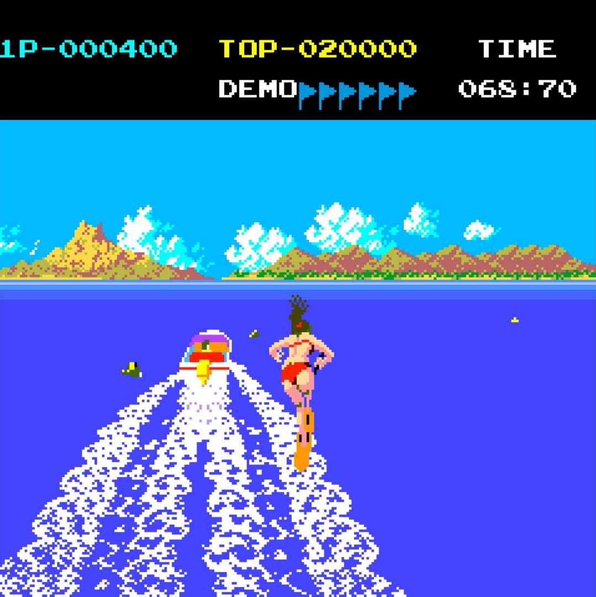

# [Tropical Angel](https://www.arcade-museum.com/game_detail.php?game_id=10205) for [MiSTer FPGA](https://mister-devel.github.io/MkDocs_MiSTer/)


Based on code from Traverse USA by [@darfpga](https://github.com/darfpga/)

Developed by [Slingshot](https://atari-forum.com/memberlist.php?mode=viewprofile&u=27648) for [MiST](https://github.com/Gehstock/Mist_FPGA/tree/master/Arcade_MiST/IremM57%20Hardware/TropicalAngel_MiST)

Ported to MiSTer by [@birdybro](https://github.com/birdybro/) with help from [Mike Simone](https://github.com/MikeS11/) and [Alan Steremberg](https://github.com/alanswx/)

## Description

This is a simulation model of the Irem M57 Arcade Hardware which only ran Tropical Angel. [From the manual](doc/manual_en.jpg):

In TROPICAL ANGEL, you are the person who leads a beautiful lady known as TROPICAL ANGEL to achieve her goal of obtaining the highest grade in water ski, A MASTER OF WATER SKI.



## Controls

| Name    | Description                 |
| ------- | --------------------------- |
| Gas     | Accelerate the boat         |
| Trick   | Spin around for more points |
| Left    | Steer boat left             |
| Right   | Steer boat right            |
| Coin    | Put in a coin               |
| Start   | Start the game              |

There is a 1P Start and a 2P Start. Each player's start button mapped corresponds to it.

## To-Do

* Hi-Score and Pause modules should be added.
* H/V offsets module should be added to help users.
* Potentially add toggle from 56.7hz to 59.94Hz similar to Ace's cores using a pll_reconfig for compatibility.

## ROM Files Instructions

ROMs are not included! In order to use this arcade core, you will need to provide the correct ROM file yourself.

To simplify the process .mra files are provided in the releases folder, that specify the required ROMs with their checksums. The ROMs .zip filename refers to the corresponding file from the MAME project.

Please refer to [Arcade Roms and MRA files](https://mister-devel.github.io/MkDocs_MiSTer/developer/mra/) for information on how to setup and use the environment.

Quick reference for folders and file placement:

```
/_Arcade/<game name>.mra
/_Arcade/cores/<game rbf>.rbf
/_Arcade/mame/<mame rom>.zip
/_Arcade/hbmame/<hbmame rom>.zip
```
